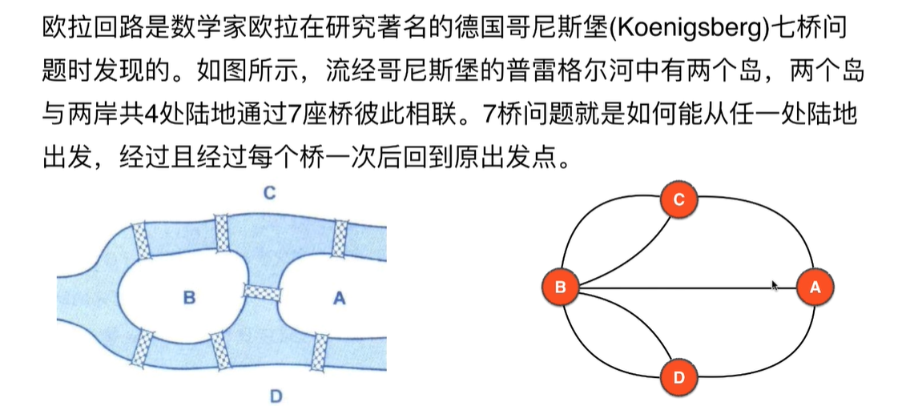
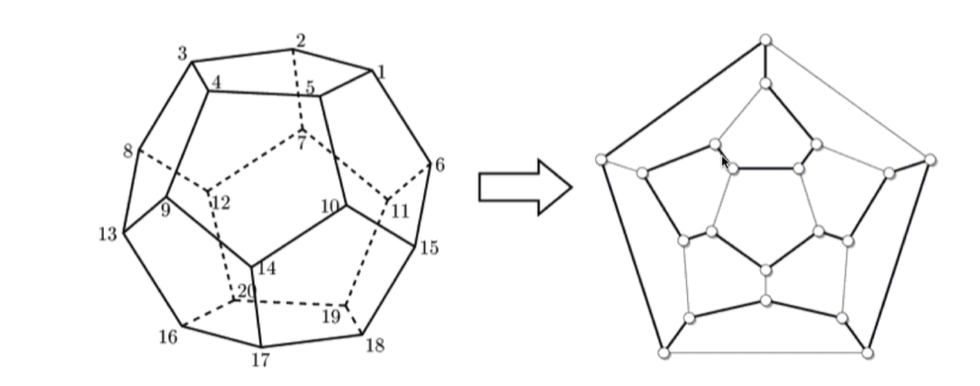
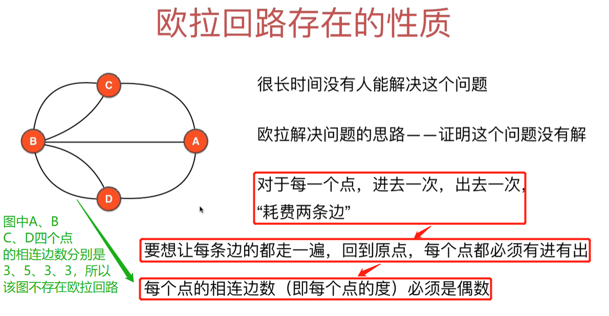

# 第10章 欧拉回路和欧拉路径

## 10.1 欧拉回路

### 欧拉回路的起源


### 欧拉回路与哈密尔顿回路的区别
> 经过所有顶点的回路不一定经过所有边。即哈密尔顿回路不一定是欧拉回路
+ 哈密尔顿回路：从一个点出发，沿着边行走，经过`每个顶点`恰好一次，之后再回到出发点
+ 欧拉回路：    从一个点出发，沿着边行走，经过`每条边`  恰好一次，之后再回到出发点

### 有哈密尔顿回路不一定有欧拉回路
> 如下图右侧的图中，所有的实现组成了哈密尔顿回路，但是并没有经过所有边，即不是欧拉回路


### 有欧拉回路不一定有哈密尔顿回路
> 欧拉回路要求每条边只能遍历一次，但是每个点可以遍历多次


## 10.2 欧拉回路的存在性及证明

### 欧拉回路存在的性质


### 欧拉回路存在的充要条件
> 注意以下几个条件
+ 无向
+ 联通
+ 每个点的度都是偶数


### 证明：图中每个点的度(临边数)是偶数--->图存在欧拉回路


### 最终定论
对于无向联通图，如果每个点的度是偶数，则图中存在欧拉回路，反过来同样成立

## 10.3 实现`欧拉回路存在性判断`的代码
> 见 [实现代码](src/main/java/Chapter10EulerLoopAndEulerPath/EulerLoop.java#L25)
```java
/**
 * 判断图中是否有欧拉回路
 */
public boolean hasEulerLoop() {
    // 1.检测联通性
    GraphDFS4ConnectedComponents cc = new GraphDFS4ConnectedComponents(graph);
    if (cc.getConnectedComponentCount()>1){
        // 多于一个联通分量肯定就不包含欧拉回路了
        return false;
    }
    // 2.所有的点的度必须都是偶数
    for (int v = 0; v < graph.V(); v++) {
        if (graph.degree(v)%2==1){
            // 如果有一个顶点的度是奇数，直接返回false
            return false;
        }
    }
    return true;
}
```

## 10.4 求解欧拉回路的3个算法

+ 回溯法：指数级时间复杂度，不可用
+ Fleury算法：基于贪心算法。时间复杂度是多项式级`O((V+E)^2)`近似为`O(E^2)`
  + 有多条边的时候，不走桥
  + 对每一个邻边，判断一下是否是`桥`(桥的查找可以参考第8章)
  + 不能预处理哪些是桥，只能每到一个点再进行判断邻边是否石桥，因为Fleury算法会动态删除边
+ Hierholzer算法：时间复杂度是`O(V+E)`近似等于`O(E)`
  > 随便从图中找一个环，并把环中的边删除，如果剩下的边可以组成环并且和删掉的环有交点，则把这两个环加起来就是欧拉路径。遇到没有临边的点就把这个点加入到最终的欧拉回路中，因为每个边走一次回退一次所以时间复杂度是O(E)

## 10.5 Hierholzer算法模拟
> 用下图来模拟算法的详细执行过程

### 基于两个栈来完成
+ curPath记录向前访问的路径
+ loop记录点没有临边时(过程中被删除了)从curPath中弹出的顺序，即为欧拉路径

### 注意
+ 1.邻接点访问是从小到大地，因为邻接点矩阵是用TreeSet存地，每访问一个点就压入curPath中
+ 2.当一个顶点没有邻接点时就进行回退，并把回退的点压入到loop中，直到回退到有邻接点的顶点，回退是纯栈的动作，不需要有邻边
+ 3.欧拉回路的寻找过程中顶点是可以重复访问地，不像哈密尔顿回路
+ 4.边用实线表示，虚线表示边已经删除
+ 5.下面遍历过程中的"回退"即不断从栈中弹出栈顶元素

### 详细遍历过程如下
+ 1.访问A，即把A压入curPath栈，此时curPath=[A]，A的邻接点有B和C，B序号小，接下来访问B
+ 2.访问B，即把B压入curPath栈，此时curPath=[A, B]，删除边AB，B的邻接点此时只剩CDE了(因为边A-B被删除了)，C序号较小，接下来访问C
  > 
+ 3.访问C，即把C压入curPath栈，此时curPath=[A, B, C]，删除边BC，C的邻接点此时只剩A(因为边B-C被删除了)，接下来访问A
  > 
+ 4.访问A，即把A压入curPath栈，此时curPath=[A, B, C, A], 删除边CA，A此时已经没有邻接点，所以需要回退A
  > 
+ 5.回退A，即把A从curPath栈中出栈，并压入loop栈，此时curPath=[A, B, C]，loop=[A]，此时回退到C，C也已经没有邻接点，需要回退C
  > 
+ 6.回退C，即把C从curPath栈中出栈，并压入loop栈，此时curPath=[A, B]，loop=[A, C]，此时回退到B，B还有邻接点D、E，所以下面访问D
  > 
+ 7.访问D，即把D压入curPath栈，此时curPath=[A, B, D]，删除边BD，D的邻接点此时只有E(因为边B-D已经被删除)，所以接下来访问E
  > 
+ 8.访问E，即把E压入curPath栈，此时curPath=[A, B, D, E]，删除边DE，E的邻接点此时只有B(因为边D-E已经被删除)，所以接下来访问B
  > 
+ 9.访问B，即把B压入curPath栈，此时curPath=[A, B, D, E, B], 删除边E-B，B此时已经没有邻接点，所以需要回退B
  > 
+ 10.回退B，即把B从curPath栈中出栈，并压入loop栈，此时curPath=[A, B, D, E]，loop=[A, C, B]，此时回退到E，所以下面访问E
  > 
+ 11.回退E，即把E从curPath栈中出栈，并压入loop栈，此时curPath=[A, B, D]，loop=[A, C, B, E]，此时回退到D，所以下面访问D
  > 
+ 12.回退D，即把D从curPath栈中出栈，并压入loop栈，此时curPath=[A, B]，loop=[A, C, B, E, D]，此时回退到B，所以下面访问B
  > 
+ 13.回退B，即把B从curPath栈中出栈，并压入loop栈，此时curPath=[A]，loop=[A, C, B, E, D, B]，此时回退到A，所以下面访问A
  > 
+ 14.回退A，即把A从curPath栈中出栈，并压入loop栈，此时curPath=[]，loop=[A, C, B, E, D, B, A]，此时curPath中为空，loop中存储地即为欧拉回路
  > 
+ 15.把栈loop元素依次出栈即得到欧拉回路的详细路径。实际欧拉回路正着看反着看都是可以的~~

## 10.6 实现Hierholzer算法
> 基于递归DFS实现地更优雅易懂~~非递归实现地有很多需要注意的地方，和上一节的理论有些出入，有待更优雅的实现
+ [基于递归DFS实现](src/main/java/Chapter10EulerLoopAndEulerPath/GraphDFSEulerLoop.java)
+ [基于非递归DFS实现](src/main/java/Chapter10EulerLoopAndEulerPath/GraphDFSNoRecursionEulerLoop.java)
  > Todo:实现地很啰嗦，很不优雅，自己研究下递归和非递归DFS实现的区别，把这个算法改地优雅些
+ [测试代码](src/main/java/Chapter10EulerLoopAndEulerPath/Main.java)

## 10.7 欧拉路径
### 欧拉回路和欧拉路径的联系和区别
+ 欧拉回路：从一个点出发，沿着边行走，每条边恰好经过一次，之后回到起始点，结束点和起始点**必须是相同**
+ 欧拉路径：从一个点出发，沿着边行走，每条边恰好经过一次，之后到达结束点，结束点和起始点**可以不相同**

### 欧拉路径的性质
> 和欧拉回路的性质进行比较
+ 欧拉回路存在的性质：对于无向联通图，`每个点的度是偶数==>则图中存在欧拉回路`，反之亦然
+ 欧拉路径存在的性质：对于无向联通图，`**除了两个点**，每个点的度是偶数==>则图中存在欧拉回路`，反之亦然。两个点就是指起始点和终止点

### Todo:代码实现
+ 判断欧拉路径存在性：简单改造下`hasEulerLoop()`方法即可
+ 求欧拉路径：仍然是使用Hierholzer算法